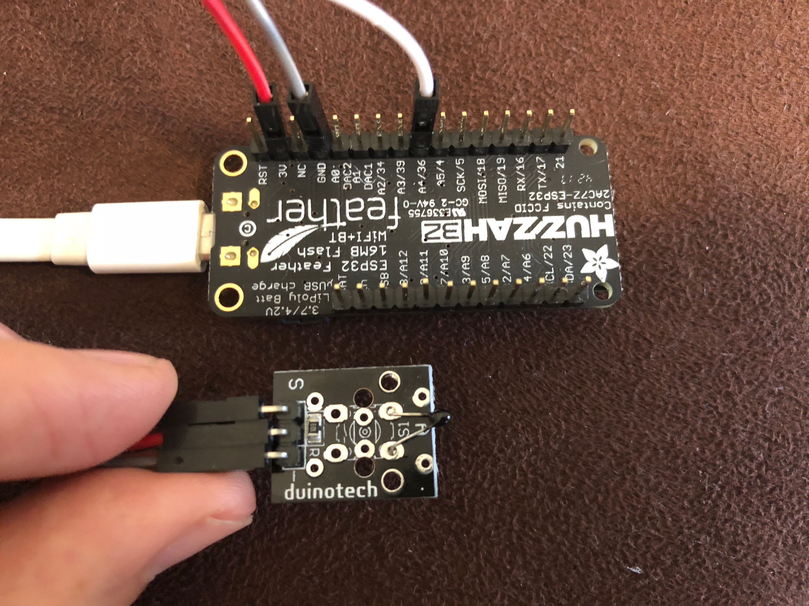

# temperature-iot
esp32 + lambda API + charting code for temperature sensing

## Steps
1. Pick a region from [the region list](https://aws.amazon.com/about-aws/global-infrastructure/regional-product-services/) that supports API Gateway, Lambda, DynamoDB, and IoT, and make sure you use that region (from the console dropdown menu) when it comes to configure AWS IoT, and also update in the [serverless.yml file](https://github.com/AcrossTheCloud/temperature-iot/blob/master/api/serverless.yml#L24) with the corresponding region string from the [table here](https://docs.aws.amazon.com/AWSEC2/latest/UserGuide/using-regions-availability-zones.html#concepts-available-regions).
2. Deploy the API per instructions below and update the web code.
3. Put the web code (under web/) somewhere, e.g. an [s3 bucket](https://docs.aws.amazon.com/AmazonS3/latest/dev/WebsiteHosting.html) optionally with [CloudFront](https://docs.aws.amazon.com/AmazonCloudFront/latest/DeveloperGuide/MigrateS3ToCloudFront.html).
4. Configure AWS IoT.
5. Build the sensor.
6. Configure and transfer the code to the sensor.

## API deployment
### Requirements
* node.js v6 or higher with corresponding npm
* serverless: `npm i -g serverless`
### Installation
```shell
cd api
serverless deploy
```
note the output URL here and update the [URL in the web code](https://github.com/AcrossTheCloud/temperature-iot/blob/master/web/js/temperature_plot.js#L25).

## Configure AWS IoT
1. [Create an AWS account if you don't have one and sign in to the IoT console.](https://docs.aws.amazon.com/iot/latest/developerguide/iot-console-signin.html)
2. [Register a thing.](https://docs.aws.amazon.com/iot/latest/developerguide/register-device.html)
3. [Create the certificate](https://docs.aws.amazon.com/iot/latest/developerguide/create-device-certificate.html) and download and copy the one ending with ".cert.pem" into esp32/main/certs/certificate.pem.crt and the one ending ".private.key" into esp32/main/certs/private.pem.key".
4. [Create a policy](https://docs.aws.amazon.com/iot/latest/developerguide/create-iot-policy.html) and when it comes to the part to add statements, add one for "iot:Connect", replacing "replaceWithAClientId" with "my_temperature_esp32" (without quotes) and effect "allow", then another one for "iot:\*", replacing "replaceWithATopic" with "topic/temperature" (without quotes, and note the word topic will appear twice as "topic/topic/temperature" on the end), and effect "allow".
5. Create a rule to transfer the IoT data into the dynamoDB table created automatically as part of the API deployment step. To do this, go to "act" in the IoT console, then create a rule. On the "create a rule" page, enter a name (e.g. temperature, but can be anything you like here), under "attribute" enter "\*" (without quotes), under "topic filter" enter "topic/temperature" (you guessed it, no quotes here although you will see single quotes automatically entered above), then "add an action". On the "select an action page" select "Split messages into multiple columns of a database table (DynamoDBv2)" then configure action. On the "Configure action" page select the "temperature" table under the table name dropdown. Click "create a new IAM role" and an enter a name (e.g. temperature but can be anything), then you need to select it from the dropdown (as it doesn't stay there), and then click "update role", then "add action" then "create rule".

## Build the sensor
* An [Adafruit Huzzah esp32](https://core-electronics.com.au/adafruit-huzzah32-esp32-feather-board-pre-soldered.html) board.
* A [thermistor](https://core-electronics.com.au/10k-precision-epoxy-thermistor-3950-ntc.html) (note if you use one with different characteristics be sure to update those values in the `#define` lines in [the esp32 code](esp32/publish_temperature.c)) and corresponding [10k resistor](https://core-electronics.com.au/resistor-10k-ohm-1-4-watt-pth-20-pack-thick-leads.html), plus [breadboard](https://core-electronics.com.au/solderless-breadboard-300-tie-points-zy-60.html) and [m-f jumper wires](https://core-electronics.com.au/jumper-wires-7-8-f-m-high-quality-30-pack.html).

Connect as per the [schematic][esp32/schematic.jpg].

Sometimes you can find packages with the termistor and resistor combined as in my setup:
<br />

## Configure and transfer code to the sensor
### Requirements
1. Set up the esp32 toolchain. [docs](https://esp-idf.readthedocs.io/en/latest/get-started/index.html#setup-toolchain)
2. [Get the esp32 IoT development framework)(https://esp-idf.readthedocs.io/en/latest/get-started/index.html#get-esp-idf) then [setup the path to the esp32 IoT development framework] (https://esp-idf.readthedocs.io/en/latest/get-started/index.html#setup-path-to-esp-idf). Note no need to go on to set up a project as there's one supplied here which we just need to configure and transfer.
3. Grab the USB drivers from  [https://www.silabs.com/products/development-tools/software/usb-to-uart-bridge-vcp-drivers] and then connect the feather board over USB to your computer.

### Configuration and transfer

```shell
cd esp32
make menuconfig
```
Be sure to set:
* the path to python2 under "SDK tool configuration",
* the USB-serial device under "Serial flasher config",
* your WiFi network and password under "Example config", and
* the AWS IoT endpoint (from `aws iot describe-endpoint` in the CLI / the AWS IoT console under "settings") into the field in "Component config" -> "Amazon Web Services IoT Platform".
then
```
make flash
```

## End result
You can see what this looks here: [https://temperature.acrossthecloud.net]

## Legal
AWS and SNTP portions of the esp32 code from the [Espressif IoT Development Framework](https://github.com/espressif/esp-idf) licensed under the [Apache license](LICENSE.apache), the rest licensed under the [GPL-v3 license](LICENSE).
